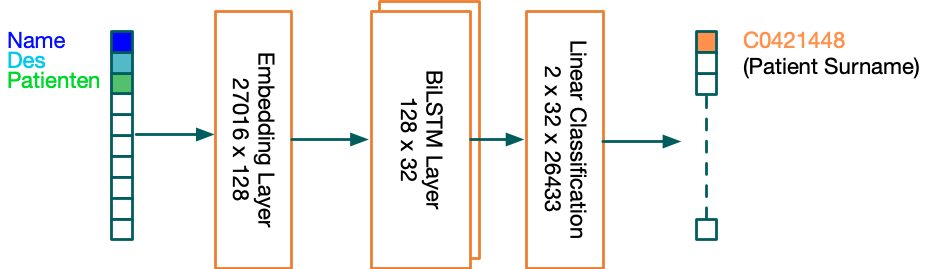

## mentored 

mentored (MEtadata aNnotaTiOn pREDiction) is a BiLSTM neural network trained to predict UMLS Codes to a given metadata description. The network consists of three layers: embedding layer, BiLSTM with 2 cells and a linear classifier.  

# results

| Model                            | t1           | t3           | t5           |     t10      |
|----------------------------------|--------------|--------------|--------------|--------------|
|     2BiLSTM   w/ Augmentation    |     67.27    |     72.85    |     74.23    |     75.63    |

|     Phrase                                        |     1. Prediction                            |     2. Prediction                                     |     3. Prediction                              |
|---------------------------------------------------|----------------------------------------------|-------------------------------------------------------|------------------------------------------------|
|     Name des Patienten (name of the patient)      |     Patient surname (25.04%)                 |     Medication name (18.32%)                          |     Patient forename (17.45%)                  |
|     Krebs der Niere     (cancer of the kidndy)    |     Kidney   cancer (24.84%)                 |     Subject   Diary (17.16%)                          |     Malignant   neoplasm of kidney (16.12%)    |
|     Krebs der Leber (cancer of the liver)         |     Malignant Placental Neoplasm (21.20%)    |     Secondary malignant neoplasm of liver (18.50%)    |     Liver reconstruction (17.72 %)             |
|     Blut (blood)                                  |     Blood   (19.38%)                         |     Blood in Urine (17.81%)                           |     Coagulation Process (17.21%)               |

# usage 

You need to implement two function within the umls_connect class in order to run the vocabulary construction.

1. run construct_pickle.py --file XXX.csv
The script expects a CSV file containing the trainings data. The input shape is "CODE";"PHRASE" --> "C0027989;newspapers"
2. run augmentation.py
3. run training.py
